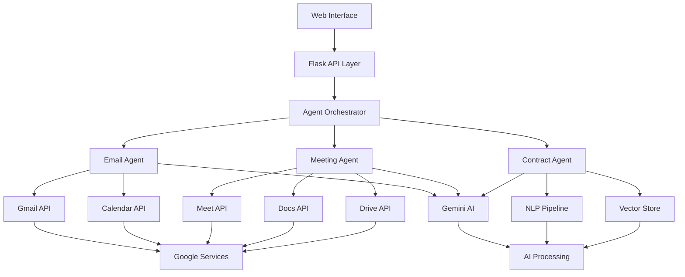
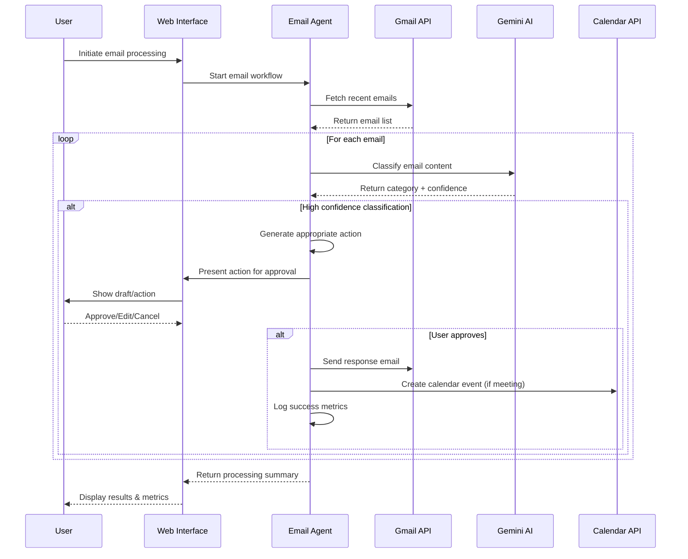
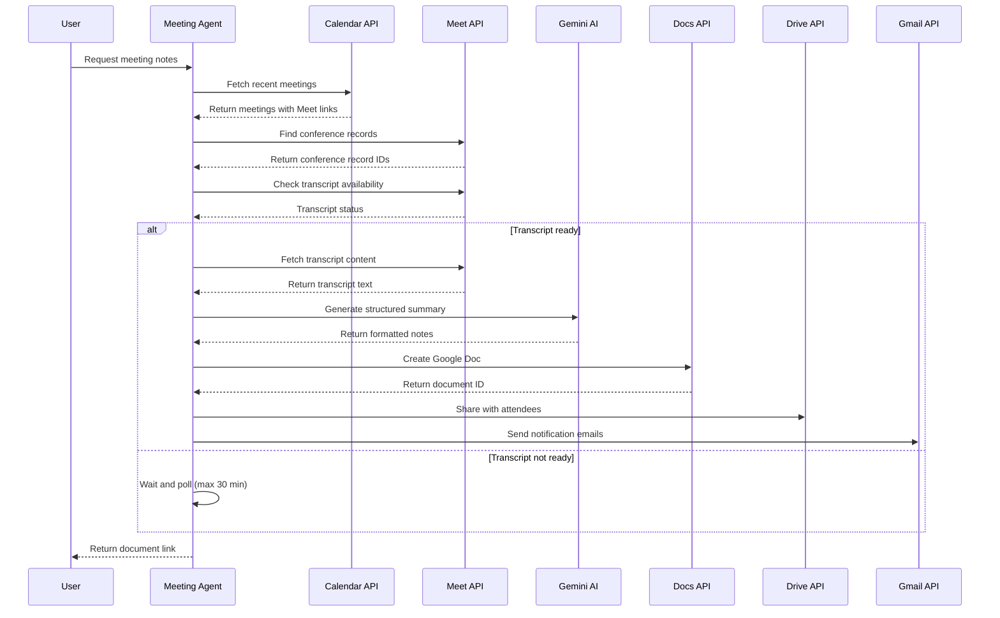
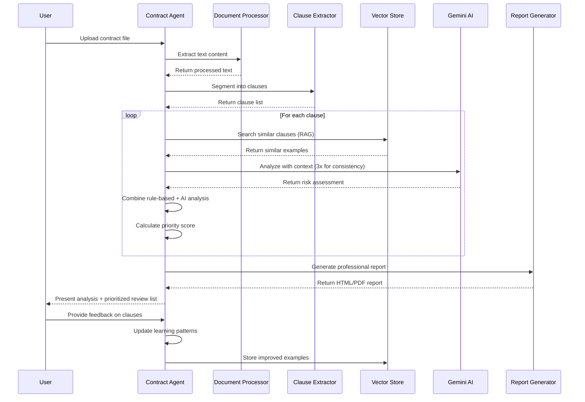

# 🔬 AgenticSuite Technical Documentation

**Comprehensive technical guide for developers, system administrators, and power users.**

---

## 📋 **Table of Contents**

1. [System Architecture](#-system-architecture)
2. [Core Technologies](#-core-technologies)
3. [Agent Deep Dive](#-agent-deep-dive)
4. [Web Interface Architecture](#-web-interface-architecture)
5. [Data Flow & Processing](#-data-flow--processing)
6. [Security & Authentication](#-security--authentication)
7. [Performance & Optimization](#-performance--optimization)
8. [API Integration](#-api-integration)
9. [Development Guidelines](#-development-guidelines)
10. [Troubleshooting & Debugging](#-troubleshooting--debugging)
11. [Extending the Platform](#-extending-the-platform)

---

## 🏗️ **System Architecture**

### **High-Level Architecture**

```
┌─────────────────────────────────────────────────────────────────┐
│                     AgenticSuite Platform                      │
├─────────────────────────────────────────────────────────────────┤
│  Web Interface (Flask)                                         │
│  ├── Dashboard (Vue.js components)                             │
│  ├── Real-time Updates (WebSocket)                             │
│  └── Authentication (OAuth2 integration)                       │
├─────────────────────────────────────────────────────────────────┤
│  Core Agent Layer                                              │
│  ├── Email Agent        ├── Meeting Agent      ├── Contract Agent│
│  │   • Classification   │   • Transcript Proc. │   • Risk Analysis│
│  │   • Scheduling       │   • Doc Generation   │   • Learning    │
│  │   • Response Gen.    │   • Distribution     │   • Reporting   │
├─────────────────────────────────────────────────────────────────┤
│  AI & Processing Layer                                         │
│  ├── Google Gemini API  ├── NLP Processing     ├── Vector Store │
│  │   • Text Analysis    │   • NLTK Pipeline    │   • ChromaDB   │
│  │   • Classification   │   • Clause Extraction│   • Embeddings │
│  │   • Content Gen.     │   • Sentiment Anal.  │   • Similarity │
├─────────────────────────────────────────────────────────────────┤
│  Google Services Integration                                   │
│  ├── Gmail API          ├── Calendar API       ├── Meet API    │
│  ├── Docs API           ├── Drive API          ├── Auth (OAuth2)│
├─────────────────────────────────────────────────────────────────┤
│  Data & Storage Layer                                          │
│  ├── Local File System  ├── Vector Database    ├── Logs & Metrics│
│  │   • Uploads          │   • Semantic Search  │   • Audit Trail│
│  │   • Reports          │   • Learning Data    │   • Performance│
└─────────────────────────────────────────────────────────────────┘
```

### **Component Interaction Flow**



---

## ⚙️ **Core Technologies**

### **Backend Framework**

**Flask Application Server** (`backend/app.py`)
```python
# Key technical specifications:
- Framework: Flask 2.3+
- CORS enabled for cross-origin requests
- Session-based state management
- Threading for concurrent processing
- Werkzeug file upload handling
- Real-time progress tracking
```

**Key Features:**
- **Multi-threaded Processing**: Handles multiple agent operations concurrently
- **WebSocket Integration**: Real-time updates for long-running operations
- **Secure File Handling**: Sanitized uploads with type validation
- **Session Management**: Stateful user interactions with timeout handling
- **Error Recovery**: Robust exception handling with fallback mechanisms

### **AI & ML Stack**

**Google Gemini Integration**
```python
# Gemini 2.5-Flash Model Configuration
model_config = {
    'model': 'gemini-2.5-flash',
    'temperature': 0.7,
    'max_tokens': 4096,
    'safety_settings': [
        # Comprehensive safety filtering
        {'category': 'HARM_CATEGORY_HARASSMENT', 'threshold': 'BLOCK_MEDIUM_AND_ABOVE'},
        {'category': 'HARM_CATEGORY_HATE_SPEECH', 'threshold': 'BLOCK_MEDIUM_AND_ABOVE'}
    ]
}
```

**Advanced NLP Pipeline**
```python
# Natural Language Processing Stack
import nltk
from nltk.tokenize import sent_tokenize, word_tokenize
from nltk.corpus import stopwords
from nltk.stem import WordNetLemmatizer

# Document processing pipeline:
1. Text extraction (PDF/DOCX/TXT + OCR fallback)
2. Sentence segmentation with NLTK
3. Clause boundary detection using regex patterns
4. Semantic fingerprinting for deduplication
5. Vector embedding generation for similarity search
```

**Vector Database** (ChromaDB)
```python
# Persistent vector storage configuration
vector_config = {
    'collection_name': 'contract_clauses',
    'embedding_function': 'gemini-embeddings',
    'distance_metric': 'cosine',
    'persistence_directory': './contractDATAtemp/vectorstore/'
}
```

---

## 🤖 **Agent Deep Dive**

### **Email Agent Architecture** (`backend/email_agent.py`)

**Core Processing Pipeline:**
```python
class EmailAgent:
    def __init__(self, lookback_hours=72, confidence_threshold=0.7):
        self.gmail_service = build('gmail', 'v1', credentials=creds)
        self.calendar_service = build('calendar', 'v3', credentials=creds)
        self.gemini_model = genai.GenerativeModel('gemini-2.5-flash')
        
    def process_emails(self):
        # 1. Fetch emails with intelligent filtering
        emails = self.fetch_recent_emails()
        
        # 2. AI-powered classification with confidence scoring
        for email in emails:
            category, confidence = self.classify_email(email)
            if confidence >= self.confidence_threshold:
                action = self.generate_action(email, category)
                user_approval = self.request_user_approval(action)
                if user_approval:
                    self.execute_action(action)
```

**Classification Categories:**
- **MEETING_REQUEST**: New meeting requests with calendar integration
- **INVOICE**: Payment-related emails with template responses
- **SCHEDULING**: Meeting updates and calendar modifications
- **FAQ**: Common questions with AI-generated answers
- **NEWSLETTER**: Promotional content (filtered/archived)
- **SPAM**: Unsolicited emails (flagged for review)
- **OTHER**: Miscellaneous emails requiring manual attention

### **Meeting Agent Architecture** (`backend/meeting_agent.py`)

**Multi-API Orchestration:**
```python
class MeetingNotesAutomation:
    def __init__(self):
        # 5 Google API services + Gemini AI
        self.calendar_service = build('calendar', 'v3')      # Meeting discovery
        self.meet_service = build('meet', 'v2')              # Transcript access
        self.docs_service = build('docs', 'v1')              # Document creation
        self.drive_service = build('drive', 'v3')            # Sharing & permissions
        self.gmail_service = build('gmail', 'v1')            # Email notifications
        self.gemini_model = genai.GenerativeModel('gemini-2.5-flash')
```

**Processing Workflow:**
```python
def run_automation_workflow(self):
    # 1. Intelligent meeting discovery
    meetings = self.list_recent_meetings(max_results=10)
    
    # 2. Conference record location with polling
    conference_record = self.find_conference_record(selected_meeting)
    
    # 3. Transcript availability waiting (with timeout)
    transcript = self.wait_for_transcript(conference_record, max_wait_minutes=30)
    
    # 4. AI-powered content generation
    ai_summary = self.generate_ai_summary(transcript, meeting_title)
    
    # 5. Professional document creation
    doc_id = self.create_google_doc(meeting_title, ai_summary, meeting_data)
    
    # 6. Automated sharing and notifications
    self.share_with_attendees(doc_id, attendees)
    self.send_email_notifications(attendees, doc_url)
```

### **Contract Agent Architecture** (`backend/contract_agent.py`)

**Research-Grade AI Implementation:**
```python
class ContractAgent:
    def __init__(self, persist_directory='./contractDATAtemp'):
        # Multi-modal AI pipeline
        self.document_processor = DocumentProcessor()
        self.clause_extractor = ClauseExtractor()
        self.vector_store = VectorStoreManager(persist_directory)
        self.risk_analyzer = RiskAnalyzer()
        self.feedback_manager = FeedbackManager()
        self.report_generator = ReportGenerator()
```

**Advanced Analysis Pipeline:**
```python
def analyze_contract(self, file_path, document_id=None):
    # 1. Multi-format document processing
    text_content = self.document_processor.extract_text(file_path)
    
    # 2. Intelligent clause segmentation
    clauses = self.clause_extractor.extract_clauses(text_content)
    
    # 3. Hybrid risk analysis (Rule-based + RAG + LLM)
    for clause in clauses:
        # Rule-based pattern matching
        rule_matches = self.apply_risk_patterns(clause)
        
        # RAG semantic retrieval
        similar_clauses = self.vector_store.search_similar(clause, n=5)
        
        # Self-consistent LLM analysis (CoVe implementation)
        analyses = []
        for iteration in range(3):
            prompt = self.vary_prompt(clause, similar_clauses, iteration)
            analysis = self.gemini_model.generate_content(prompt)
            analyses.append(analysis)
        
        # Majority voting and confidence aggregation
        final_assessment = self.aggregate_analyses(analyses)
        
        # Combine rule-based and LLM results
        clause.risk_assessment = self.combine_assessments(rule_matches, final_assessment)
    
    return ContractAnalysis(clauses, executive_summary, metadata)
```

---

## 🌐 **Web Interface Architecture**

### **Frontend Structure** (`frontend/`)

```
frontend/
├── templates/           # Jinja2 templates
│   ├── base.html       # Common layout and navigation
│   ├── dashboard.html  # Main dashboard with agent cards
│   ├── email.html      # Email agent interface (25KB, 678 lines)
│   ├── meeting.html    # Meeting agent interface (16KB, 402 lines)
│   ├── contract.html   # Contract agent interface (35KB, 763 lines)
│   └── auth.html       # Authentication flow
├── static/
│   ├── css/style.css   # Responsive styling with Bootstrap
│   └── js/app.js       # Vanilla JS for dynamic interactions
```

### **Real-Time Communication**

**WebSocket Integration:**
```javascript
// Real-time progress updates
function connectWebSocket() {
    const ws = new WebSocket('ws://localhost:5000/ws');
    
    ws.onmessage = function(event) {
        const data = JSON.parse(event.data);
        updateProgressBar(data.progress);
        updateStatusMessage(data.status);
        refreshAgentMetrics(data.metrics);
    };
}
```

**AJAX API Calls:**
```javascript
// Asynchronous agent operations
async function processEmails() {
    showLoadingSpinner();
    
    try {
        const response = await fetch('/api/email/process', {
            method: 'POST',
            headers: {'Content-Type': 'application/json'},
            body: JSON.stringify({lookback_hours: 72})
        });
        
        const result = await response.json();
        displayResults(result);
    } catch (error) {
        showErrorMessage(error);
    }
}
```

### **Responsive Design**

**Mobile-First Approach:**
```css
/* Responsive breakpoints */
@media (max-width: 768px) {
    .agent-card { width: 100%; }
    .dashboard-grid { grid-template-columns: 1fr; }
}

@media (min-width: 769px) {
    .dashboard-grid { grid-template-columns: repeat(3, 1fr); }
}
```

---

## 🔄 **Data Flow & Processing**

### **Email Processing Flow**



### **Meeting Notes Generation Flow**



### **Contract Analysis Flow**



---

## 🔐 **Security & Authentication**

### **OAuth2 Implementation**

**Centralized Authentication** (`backend/auth.py`):
```python
# Comprehensive scope management
SCOPES = [
    'https://www.googleapis.com/auth/calendar.readonly',
    'https://www.googleapis.com/auth/calendar',
    'https://www.googleapis.com/auth/gmail.send',
    'https://www.googleapis.com/auth/gmail.readonly',
    'https://www.googleapis.com/auth/gmail.modify',
    'https://www.googleapis.com/auth/meetings.space.readonly',
    'https://www.googleapis.com/auth/meetings.space.created',
    'https://www.googleapis.com/auth/documents',
    'https://www.googleapis.com/auth/drive.file',
    'https://www.googleapis.com/auth/drive'
]

def authenticate_google():
    """Secure OAuth2 flow with token refresh"""
    creds = None
    
    # Load existing credentials
    if os.path.exists('token.json'):
        creds = Credentials.from_authorized_user_file('token.json', SCOPES)
    
    # Refresh expired tokens
    if not creds or not creds.valid:
        if creds and creds.expired and creds.refresh_token:
            creds.refresh(Request())
        else:
            # Run OAuth flow for new credentials
            flow = InstalledAppFlow.from_client_secrets_file(
                'client_secret.json', SCOPES)
            creds = flow.run_local_server(port=0)
    
    # Save credentials securely
    with open('token.json', 'w') as token:
        token.write(creds.to_json())
    
    return creds
```

### **Data Security Measures**

**Local Data Processing:**
- ✅ **No cloud storage** of sensitive data
- ✅ **Local file system** for all uploads and processing
- ✅ **Encrypted token storage** with automatic refresh
- ✅ **Secure session management** with timeout controls

**API Security:**
```python
# Rate limiting and quota management
class APIManager:
    def __init__(self):
        self.request_counts = defaultdict(int)
        self.last_reset = time.time()
    
    def check_quota(self, service_name):
        if self.request_counts[service_name] > QUOTA_LIMITS[service_name]:
            raise QuotaExceededError(f"Daily quota exceeded for {service_name}")
    
    def make_request(self, service, method, **kwargs):
        self.check_quota(service.name)
        self.request_counts[service.name] += 1
        return method(**kwargs)
```

### **Privacy Protection**

**Data Handling Principles:**
1. **Minimal Data Retention**: Process and discard unnecessary data
2. **User Consent**: Explicit approval for all automated actions
3. **Audit Trails**: Complete logging of all system decisions
4. **Local Processing**: AI analysis happens on user's machine
5. **Secure Deletion**: Proper cleanup of temporary files

---

## ⚡ **Performance & Optimization**

### **API Efficiency**

**Intelligent Batching:**
```python
class BatchProcessor:
    def __init__(self, batch_size=10):
        self.batch_size = batch_size
        self.request_queue = []
    
    def add_request(self, request):
        self.request_queue.append(request)
        if len(self.request_queue) >= self.batch_size:
            self.process_batch()
    
    def process_batch(self):
        # Process multiple requests in single API call
        batch_results = self.api_service.batch_execute(self.request_queue)
        self.request_queue.clear()
        return batch_results
```

**Caching Strategy:**
```python
from functools import lru_cache
import pickle
import hashlib

class SmartCache:
    def __init__(self, cache_dir='./cache'):
        self.cache_dir = cache_dir
        os.makedirs(cache_dir, exist_ok=True)
    
    @lru_cache(maxsize=256)
    def get_ai_classification(self, email_content_hash):
        """Cache AI classifications to reduce API calls"""
        cache_key = f"classification_{email_content_hash}"
        return self._get_from_cache(cache_key)
    
    def _get_from_cache(self, key):
        cache_file = os.path.join(self.cache_dir, f"{key}.pkl")
        if os.path.exists(cache_file):
            with open(cache_file, 'rb') as f:
                return pickle.load(f)
        return None
```

### **Memory Management**

**Efficient Text Processing:**
```python
def process_large_document(file_path):
    """Process large documents in chunks to avoid memory issues"""
    chunk_size = 10000  # Process 10KB chunks
    
    with open(file_path, 'r', encoding='utf-8') as file:
        while True:
            chunk = file.read(chunk_size)
            if not chunk:
                break
            
            # Process chunk independently
            processed_chunk = process_text_chunk(chunk)
            yield processed_chunk
```

### **Database Optimization**

**ChromaDB Performance Tuning:**
```python
# Optimized vector store configuration
vector_config = {
    'hnsw_space': 'cosine',           # Efficient similarity search
    'hnsw_construction_ef': 200,      # Build quality vs. speed
    'hnsw_m': 16,                     # Memory vs. accuracy tradeoff
    'batch_size': 100,                # Bulk operations
    'persist_directory': './vectorstore'
}
```

---

## 🔌 **API Integration Details**

### **Google APIs Integration**

**Service Discovery and Building:**
```python
def build_google_services(credentials):
    """Initialize all required Google API services"""
    services = {}
    
    api_configs = [
        ('gmail', 'v1'),
        ('calendar', 'v3'),
        ('meet', 'v2'),
        ('docs', 'v1'),
        ('drive', 'v3')
    ]
    
    for service_name, version in api_configs:
        try:
            services[service_name] = build(
                service_name, version, 
                credentials=credentials,
                cache_discovery=False  # Avoid caching issues
            )
            logger.info(f"✅ {service_name} API initialized")
        except Exception as e:
            logger.error(f"❌ Failed to initialize {service_name} API: {e}")
    
    return services
```

**Error Handling and Retries:**
```python
from google.api_core import retry
from google.api_core.exceptions import GoogleAPIError

@retry.Retry(predicate=retry.if_exception_type(GoogleAPIError))
def resilient_api_call(service_method, **kwargs):
    """Make API calls with automatic retry on transient failures"""
    try:
        return service_method(**kwargs).execute()
    except HttpError as error:
        if error.resp.status in [429, 500, 502, 503, 504]:
            # Retry on rate limits and server errors
            raise error
        else:
            # Don't retry on client errors
            logger.error(f"API call failed: {error}")
            return None
```

### **Gemini AI Integration**

**Advanced Prompt Engineering:**
```python
class PromptTemplate:
    EMAIL_CLASSIFICATION = """
    Analyze this email and classify it into one of these categories:
    
    Categories:
    - MEETING_REQUEST: Requests for new meetings, calls, or appointments
    - INVOICE: Bills, receipts, payment requests
    - SCHEDULING: Meeting replies, calendar updates, rescheduling
    - FAQ: Common questions or information requests
    - NEWSLETTER: Promotional or informational mass emails
    - SPAM: Unsolicited commercial emails
    - OTHER: Emails that don't fit other categories
    
    Email Details:
    Subject: {subject}
    From: {sender}
    Body: {body_preview}
    
    Respond in format: CATEGORY,confidence_score
    Example: MEETING_REQUEST,0.95
    
    Consider:
    - Email content tone and intent
    - Sender relationship and domain
    - Presence of meeting-related keywords
    - Request for action or response
    """
    
    CONTRACT_ANALYSIS = """
    You are an expert legal analyst reviewing contract clauses for potential risks.
    
    Analyze this clause for legal and business risks:
    
    Clause Text: {clause_text}
    Clause Type: {clause_type}
    
    Similar Historical Clauses for Context:
    {similar_clauses}
    
    Provide analysis in this format:
    
    RISK_LEVEL: [HIGH/MEDIUM/LOW]
    CONFIDENCE: [0.0-1.0]
    RATIONALE: [Detailed explanation of risk factors]
    SUGGESTIONS: [Specific recommendations for improvement]
    LEGAL_CONCERNS: [Potential legal issues]
    BUSINESS_IMPACT: [Commercial implications]
    
    Focus on:
    - Unusual or non-standard language
    - Potential liability exposure
    - Unfavorable terms or conditions
    - Missing protective clauses
    - Regulatory compliance issues
    """
```

---

## 👨‍💻 **Development Guidelines**

### **Code Structure Standards**

**Agent Implementation Pattern:**
```python
class BaseAgent:
    """Abstract base class for all AgenticSuite agents"""
    
    def __init__(self, credentials, config=None):
        self.credentials = credentials
        self.config = config or self.get_default_config()
        self.logger = self.setup_logging()
        self.metrics = MetricsCollector()
    
    @abstractmethod
    def process(self, input_data):
        """Main processing method - must be implemented by subclasses"""
        pass
    
    def setup_logging(self):
        """Configure agent-specific logging"""
        logger = logging.getLogger(self.__class__.__name__)
        handler = logging.FileHandler(f'{self.config.log_directory}/{self.__class__.__name__.lower()}.log')
        formatter = logging.Formatter('%(asctime)s - %(name)s - %(levelname)s - %(message)s')
        handler.setFormatter(formatter)
        logger.addHandler(handler)
        return logger
    
    def collect_metrics(self, operation, result):
        """Standardized metrics collection"""
        self.metrics.record(
            operation=operation,
            timestamp=datetime.now(),
            success=result.success,
            processing_time=result.duration,
            user_satisfaction=result.user_feedback
        )
```

### **Error Handling Standards**

**Comprehensive Exception Management:**
```python
class AgenticSuiteException(Exception):
    """Base exception for all AgenticSuite errors"""
    pass

class AuthenticationError(AgenticSuiteException):
    """Authentication and authorization failures"""
    pass

class APIQuotaExceededError(AgenticSuiteException):
    """Google API quota limitations"""
    pass

class ProcessingTimeoutError(AgenticSuiteException):
    """Long-running operations that timeout"""
    pass

def handle_agent_errors(func):
    """Decorator for standardized error handling"""
    def wrapper(*args, **kwargs):
        try:
            return func(*args, **kwargs)
        except AuthenticationError as e:
            logger.error(f"Authentication failed: {e}")
            return ErrorResult("AUTHENTICATION_FAILED", str(e))
        except APIQuotaExceededError as e:
            logger.warning(f"API quota exceeded: {e}")
            return ErrorResult("QUOTA_EXCEEDED", str(e))
        except Exception as e:
            logger.exception(f"Unexpected error in {func.__name__}: {e}")
            return ErrorResult("INTERNAL_ERROR", str(e))
    return wrapper
```

### **Testing Framework**

**Unit Testing Standards:**
```python
import unittest
from unittest.mock import Mock, patch
import pytest

class TestEmailAgent(unittest.TestCase):
    def setUp(self):
        self.mock_credentials = Mock()
        self.email_agent = EmailAgent(self.mock_credentials)
    
    @patch('email_agent.build')
    def test_email_classification(self, mock_build):
        # Mock Google API responses
        mock_service = Mock()
        mock_build.return_value = mock_service
        
        # Test email classification accuracy
        test_email = {
            'subject': 'Meeting Request - Q4 Planning',
            'body': 'Can we schedule a meeting for next week?',
            'sender': 'colleague@company.com'
        }
        
        result = self.email_agent.classify_email(test_email)
        
        self.assertEqual(result.category, 'MEETING_REQUEST')
        self.assertGreater(result.confidence, 0.8)
    
    def test_meeting_scheduling(self):
        # Test calendar integration and slot finding
        pass
    
    def test_response_generation(self):
        # Test AI-powered response quality
        pass
```

---

## 🔧 **Troubleshooting & Debugging**

### **Common Issues and Solutions**

**1. Authentication Problems**
```bash
# Symptom: "OAuth2 authentication failed"
# Solution: Clear and regenerate tokens
rm backend/token.json
cd backend
python auth.py

# Verify credentials file exists
ls -la client_secret*.json
```

**2. API Quota Issues**
```python
# Monitor API usage
def check_api_quotas():
    quotas = {
        'gmail': {'daily': 1000000000, 'per_user': 250},
        'calendar': {'daily': 1000000, 'per_user': 10000},
        'drive': {'daily': 20000, 'per_user': 1000}
    }
    
    for service, limits in quotas.items():
        current_usage = get_current_usage(service)
        if current_usage > limits['daily'] * 0.9:
            logger.warning(f"{service} approaching daily quota limit")
```

**3. Processing Timeouts**
```python
# Increase timeout for large operations
def process_large_contract(file_path, timeout=300):
    """Process contracts with extended timeout"""
    signal.alarm(timeout)  # Set timeout alarm
    try:
        result = contract_agent.analyze_contract(file_path)
    except TimeoutError:
        logger.error(f"Processing timeout after {timeout} seconds")
        return PartialResult("TIMEOUT", partial_data)
    finally:
        signal.alarm(0)  # Clear alarm
```

### **Debug Mode Configuration**

**Enable Detailed Logging:**
```python
# Enable debug mode in app.py
app.debug = True
logging.basicConfig(level=logging.DEBUG)

# Agent-specific debug settings
email_agent = EmailAgent(
    debug_mode=True,
    verbose_logging=True,
    save_intermediate_results=True
)
```

**Performance Profiling:**
```python
import cProfile
import pstats

def profile_agent_operation(operation_func):
    """Profile agent operations for performance optimization"""
    profiler = cProfile.Profile()
    profiler.enable()
    
    result = operation_func()
    
    profiler.disable()
    stats = pstats.Stats(profiler)
    stats.sort_stats('cumulative')
    stats.print_stats(20)  # Top 20 functions by cumulative time
    
    return result
```

---

## 🚀 **Extending the Platform**

### **Adding New Agents**

**Agent Development Template:**
```python
from base_agent import BaseAgent
import logging

class CustomAgent(BaseAgent):
    """Template for developing new agents"""
    
    def __init__(self, credentials, config=None):
        super().__init__(credentials, config)
        self.setup_custom_services()
    
    def setup_custom_services(self):
        """Initialize agent-specific services"""
        # Example: Add Slack API, Jira API, etc.
        pass
    
    def process(self, input_data):
        """Main processing logic"""
        try:
            # 1. Validate input
            validated_input = self.validate_input(input_data)
            
            # 2. AI processing
            ai_result = self.ai_analysis(validated_input)
            
            # 3. Action generation
            actions = self.generate_actions(ai_result)
            
            # 4. User approval
            approved_actions = self.request_approval(actions)
            
            # 5. Execute approved actions
            results = self.execute_actions(approved_actions)
            
            # 6. Collect metrics
            self.collect_metrics('process', results)
            
            return results
            
        except Exception as e:
            self.logger.error(f"Processing failed: {e}")
            return self.handle_error(e)
    
    def validate_input(self, input_data):
        """Validate and sanitize input data"""
        pass
    
    def ai_analysis(self, data):
        """Perform AI analysis on input data"""
        pass
    
    def generate_actions(self, analysis_result):
        """Generate actionable items from analysis"""
        pass
    
    def request_approval(self, actions):
        """Request user approval for actions"""
        pass
    
    def execute_actions(self, actions):
        """Execute approved actions"""
        pass
```

### **Web Interface Integration**

**Add Agent to Flask App:**
```python
# In backend/app.py
from custom_agent import CustomAgent

# Initialize agent
custom_agent = None

@app.route('/api/custom/process', methods=['POST'])
def process_custom_data():
    global custom_agent
    
    if not custom_agent:
        custom_agent = CustomAgent(get_credentials())
    
    input_data = request.json
    result = custom_agent.process(input_data)
    
    return jsonify(result.to_dict())

# Add frontend template
@app.route('/custom')
def custom_agent_page():
    return render_template('custom.html')
```

### **Database Extensions**

**Add Custom Data Storage:**
```python
class CustomDataManager:
    """Manage custom agent data storage"""
    
    def __init__(self, storage_dir):
        self.storage_dir = storage_dir
        self.setup_storage()
    
    def setup_storage(self):
        """Initialize storage structure"""
        directories = [
            f"{self.storage_dir}/data",
            f"{self.storage_dir}/logs",
            f"{self.storage_dir}/cache"
        ]
        
        for directory in directories:
            os.makedirs(directory, exist_ok=True)
    
    def store_result(self, result_data):
        """Store processing results"""
        timestamp = datetime.now().isoformat()
        filename = f"result_{timestamp}.json"
        filepath = os.path.join(self.storage_dir, 'data', filename)
        
        with open(filepath, 'w') as f:
            json.dump(result_data, f, indent=2)
    
    def get_historical_data(self, query_params):
        """Retrieve historical processing data"""
        # Implement querying logic
        pass
```

---

## 📊 **Monitoring & Analytics**

### **Performance Metrics**

**Comprehensive Metrics Collection:**
```python
class MetricsCollector:
    def __init__(self):
        self.metrics_file = './metrics/agent_performance.csv'
        self.setup_metrics_storage()
    
    def record_operation(self, agent_name, operation, duration, success, user_feedback=None):
        """Record operation metrics"""
        metrics_data = {
            'timestamp': datetime.now().isoformat(),
            'agent': agent_name,
            'operation': operation,
            'duration_seconds': duration,
            'success': success,
            'user_satisfaction': user_feedback
        }
        
        self.append_to_csv(metrics_data)
    
    def generate_performance_report(self):
        """Generate comprehensive performance analytics"""
        df = pd.read_csv(self.metrics_file)
        
        report = {
            'total_operations': len(df),
            'success_rate': df['success'].mean(),
            'average_duration': df['duration_seconds'].mean(),
            'user_satisfaction': df['user_satisfaction'].mean(),
            'operations_by_agent': df.groupby('agent').size().to_dict()
        }
        
        return report
```

---

This technical documentation provides comprehensive coverage of the AgenticSuite platform architecture, implementation details, and development guidelines. For specific agent documentation, refer to the individual agent README files:

- **[Email Agent Details](MAIL_AGENT_README.md)**
- **[Meeting Agent Details](MEETING_AGENT_README.md)**  
- **[Contract Agent Details](CONTRACT_AGENT_README.md)**

For setup instructions, see **[SETUP.md](SETUP.md)**.